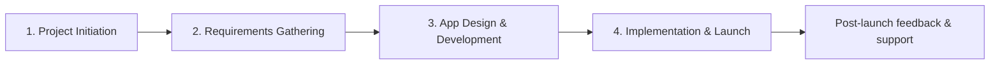

# Cross-University Mobile App — Project Management Portfolio

[](docs/PROJECT_INITIATION_DOCUMENT.md)
[](docs/PROJECT_CONTEXT.md)
[](data/gantt_schedule.csv)
[](https://github.com/ibrahimm2106/Cross-University-Mobile-App-Project-Management/actions/workflows/portfolio-check.yml)

A structured project-management portfolio case study for a proposed **cross-university mobile application connecting students, clubs and societies across London universities**.

The repository translates the original academic project into a recruiter-friendly portfolio: the Project Initiation Document (PID), stakeholder analysis, Work Breakdown Structure (WBS), Gantt schedule, budget, risk-management work and project-leadership analysis are separated into clear, navigable artefacts.

> **Academic context:** this is a fictitious university case study, not a claim that the application was commissioned or delivered in production.

## Project at a glance

| Area | Portfolio evidence |
|---|---|
| Project initiation | Objectives, scope, approach, governance and budget |
| Stakeholder management | 12 stakeholder groups with impact/influence ratings and engagement approaches |
| Planning | Four-phase WBS with 30 scheduled tasks |
| Scheduling | Gantt-derived task dataset, milestones and dependencies |
| Risk management | Risk-register analysis, ownership, mitigation and contingency thinking |
| Leadership | Sponsor vs project-manager responsibilities |
| Methodology | Source recommendation for a hybrid Agile + PRINCE2 approach |

### Key project figures

- **PID period:** 1 September 2025 → 31 August 2026
- **Detailed delivery schedule:** 1 September 2025 → 23 February 2026
- **Budget:** **£22,550**
- **Scheduled tasks:** **30**
- **Major phases:** **4**
- **Milestones:** **4**
- **Stakeholder groups analysed:** **12**

The PID and detailed Gantt use different end dates in the supplied source material. Both are retained here rather than silently reconciled: the PID represents the wider project window, while the workbook provides the detailed delivery schedule available in the source files.

## Delivery lifecycle



## Repository guide

```text
.
├── README.md
├── .github/
│   └── workflows/
│       └── portfolio-check.yml
├── data/
│   ├── budget.csv
│   ├── gantt_schedule.csv
│   └── stakeholders.csv
├── docs/
│   ├── PROJECT_CONTEXT.md
│   ├── PROJECT_INITIATION_DOCUMENT.md
│   ├── STAKEHOLDER_MANAGEMENT.md
│   ├── WBS_AND_SCHEDULE.md
│   ├── RISK_MANAGEMENT.md
│   ├── PROJECT_LEADERSHIP.md
│   ├── METHODOLOGY_AND_CONTEXT.md
│   └── SOURCE_NOTES.md
├── scripts/
│   └── validate_portfolio.py
└── .gitignore
```

## Explore the portfolio

1. **[Project context](docs/PROJECT_CONTEXT.md)** — business case, objectives and assumptions.
2. **[Project Initiation Document](docs/PROJECT_INITIATION_DOCUMENT.md)** — dates, budget, approach and governance.
3. **[Stakeholder management](docs/STAKEHOLDER_MANAGEMENT.md)** — stakeholder prioritisation and engagement.
4. **[WBS & schedule](docs/WBS_AND_SCHEDULE.md)** — 30-task plan, milestones and dependencies.
5. **[Risk management](docs/RISK_MANAGEMENT.md)** — source-grounded risk register summary and portfolio notes.
6. **[Project leadership](docs/PROJECT_LEADERSHIP.md)** — sponsor and project-manager responsibilities.
7. **[Methodology & context](docs/METHODOLOGY_AND_CONTEXT.md)** — what the source says about Agile, PRINCE2 and the assessment requirement.

## Selected milestones

| Milestone | Source timing |
|---|---|
| M1 — Project Team Formed | Week 2 |
| M2 — Requirements Document Approved | Week 7 |
| M3 — Design Prototype Approved | Week 10 |
| M4 — App Launch | Week 20 |

## Portfolio validation

A lightweight GitHub Actions workflow runs `scripts/validate_portfolio.py` to make sure the structured portfolio data remains internally consistent. It verifies the 30-task Gantt extract, the £22,550 budget total, stakeholder data and required documentation files.

## Skills demonstrated

`Project Planning` · `Stakeholder Analysis` · `WBS` · `Gantt Scheduling` · `Risk Management` · `Budgeting` · `Project Governance` · `Leadership` · `Agile` · `PRINCE2` · `Documentation` · `Communication`

## Scope and transparency

This repository is a **portfolio presentation of academic work**. The underlying case scenario is fictitious. Source-derived information is kept separate from later portfolio formatting and validation improvements. Where the supplied report and assessment brief differ, the difference is documented instead of being rewritten as if it were part of the original submission.
