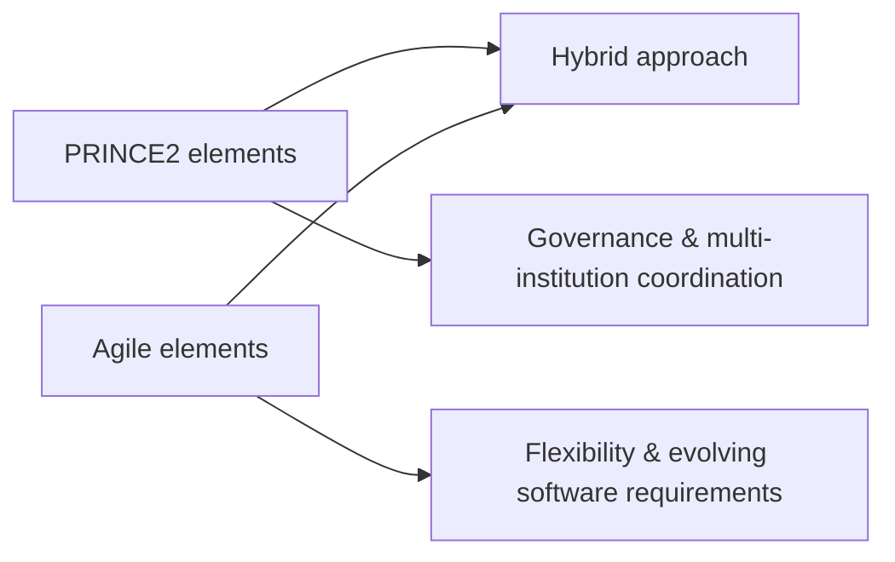

# Methodology & Assessment Context

## What the assessment brief required

The assessment brief asked for an **analysis and critique of Agile, Waterfall and PRINCE2**, including strengths, weaknesses and a justified recommendation for the case study.

## What the supplied report supports

The supplied report's conclusion states that the proposed implementation approach **combines elements of Agile and PRINCE2**. It explains the rationale at a high level:

- PRINCE2-style structure supports governance and coordination across multiple institutions;
- Agile-style flexibility supports software development and adaptation to evolving requirements and feedback.

The source files provided for this repository do **not** contain a clearly separated, detailed three-way Agile-vs-Waterfall-vs-PRINCE2 comparison section. This portfolio therefore records the recommendation that is present without fabricating omitted analysis.

## Source recommendation

## Case-study strengths highlighted in the report

The conclusion identifies several factors supporting the project:

- EE sponsorship provides technical expertise and development resources without additional app-development cost;
- Roehampton University's leadership and Vice-Chancellor support provide institutional backing and visibility;
- alignment with National Union of Students objectives creates potential for broader future rollout.

## Case-study challenges highlighted in the report

The conclusion also identifies challenges that need management attention:

- coordinating universities with different systems, priorities and academic calendars;
- maintaining engagement from volunteer representatives;
- balancing technical requirements with user-experience needs;
- coordinating closely with EE's development team.

## Academic-to-portfolio boundary

This file intentionally separates **what the source report actually states** from what would be needed to produce a fuller methodology comparison. It is designed to make the repository credible to reviewers without rewriting the original coursework after the fact.
