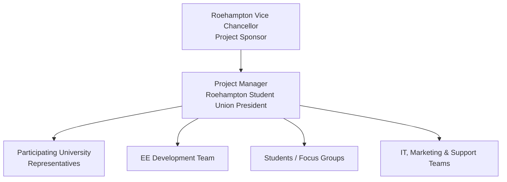

# Project Initiation Document (PID)

## Project title

**Roehampton Cross-University Mobile App for London Universities**

## Project window

| Item | Source value |
|---|---|
| Project start | 1 September 2025 |
| Project end | 31 August 2026 |
| Detailed Gantt delivery window | 1 September 2025 to 23 February 2026 |
| Project manager | Roehampton Student Union President |

The supplied PID and Gantt workbook use different end dates. The repository preserves both: the PID states the wider project window, while the detailed workbook schedules the delivery activities available in the source material through February 2026.

## Budget

The PID states a total budget of **£22,550**.

| Budget item | Amount |
|---|---:|
| Project Management | £0 |
| University Representatives | £0 |
| Student Focus Groups | £2,500 |
| Marketing Materials | £3,500 |
| Launch Events | £5,000 |
| Student Ambassador Program | £4,000 |
| Technical Integration Support | £3,000 |
| App Development | £0 |
| User Testing | £2,000 |
| Contingency | £2,550 |
| **Total** | **£22,550** |

The source explains that project management is covered by existing Student Union staff, university representation is an in-kind contribution, and app development is provided through EE sponsorship.

A machine-readable version is available in [`data/budget.csv`](../data/budget.csv).

## Project objectives

The source project seeks to create a platform for cross-university interaction around social activity, clubs and societies across London universities, with a future ambition for national rollout. The intended outcomes include:

- maximising opportunities available to students;
- supporting diversity and inclusion objectives;
- providing daily information about university club and society events;
- linking students to contact information;
- enabling students to promote their own events;
- coordinating contributions from participating universities.

## Proposed approach

The PID sets out the following management approach:

1. Build a schedule covering personnel and project activity.
2. Establish governance with representatives from participating student unions.
3. Investigate existing university-event platforms and integration opportunities.
4. Gather student needs and preferences through focus groups.
5. Develop technical requirements with the EE development team.
6. Create and test user-experience prototypes with student representatives.
7. Define privacy and data-sharing procedures aligned with university requirements and GDPR.
8. Use staged implementation with clear deliverables and milestones.
9. Develop a testing plan involving students from multiple universities.
10. Prepare communication and marketing strategies for launch.

## Governance view

This diagram is a portfolio visualisation of the stakeholder roles described in the source report; it is not an additional source artefact from the original submission.
