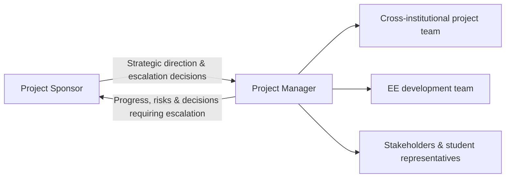

# Project Leadership

The source report distinguishes the **project sponsor** from the **project manager** and argues that project leadership requires specialist skills rather than simply assigning management responsibility to any available person.

## Project sponsor — Roehampton Vice Chancellor

The report identifies five sponsor responsibilities:

1. **Strategic direction** — provide high-level vision and ensure alignment with organisational objectives.
2. **Resource commitment** — secure resources and institutional support.
3. **Decision authority** — make critical decisions, particularly when escalated by the project manager.
4. **Championing the project** — advocate for the initiative at executive level across participating universities.
5. **Accountability** — remain ultimately accountable for project success and benefits realisation.

## Project manager

The report identifies ten areas of responsibility for the project manager:

1. Comprehensive planning
2. Stakeholder management
3. Risk management
4. Team leadership
5. Communication management
6. Quality assurance
7. Change management
8. Problem resolution
9. Progress monitoring
10. Vendor management, including coordination with the EE development team

## Relationship between the roles

## Why the distinction matters for this case

The source report highlights the complexity of the initiative: multiple universities, different priorities, technical integration challenges and reliance on volunteers. The project manager therefore needs day-to-day planning, stakeholder coordination, risk control and communication skills, while the sponsor provides authority, institutional backing and strategic oversight.

The report concludes that successful leadership depends on **clear role definition and effective collaboration**, with sponsor and project manager contributing different forms of leadership while respecting the boundaries of their responsibilities.
