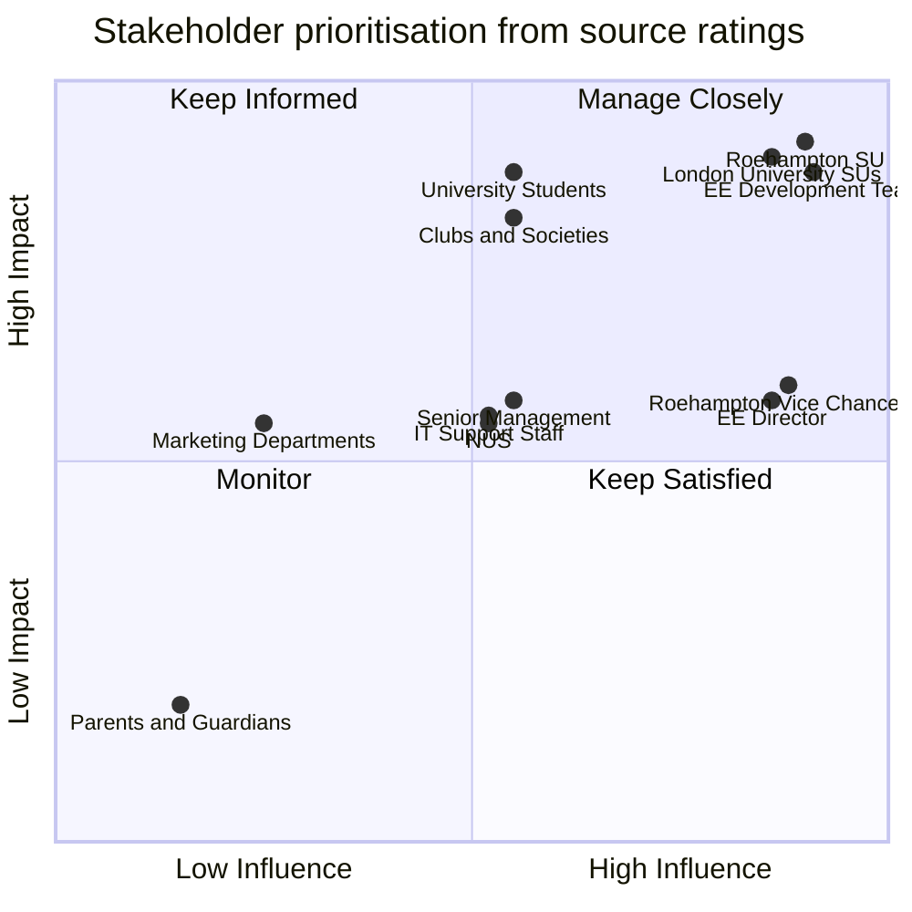

# Stakeholder Management

The source report identifies **12 stakeholder groups** and rates each by impact and influence. It also records the contribution expected from each group and engagement tactics such as status meetings, workshops, focus groups, technical sessions and executive briefings.

## Stakeholder summary

| Stakeholder | Impact | Influence | Role / contribution |
|---|---|---|---|
| Roehampton Student Union | High | High | Leads the project and coordinates participating universities |
| Other London Universities Student Unions | High | High | Provide resources and represent student interests |
| EE Development Team | High | High | Provides technical expertise and development resources |
| University Students | High | Medium | End users, feedback providers and early adopters |
| Student Clubs and Societies | High | Medium | Event/content providers and key users |
| Roehampton Vice Chancellor | Medium | High | Sponsor and institutional supporter |
| Other Universities Senior Management | Medium | Medium | Institutional support and potential resource allocation |
| EE Director | Medium | High | Corporate champion within EE |
| IT Support Staff | Medium | Medium | Technical integration and data-protection support |
| National Union of Students | Medium | Medium | Strategic guidance and possible national rollout support |
| University Marketing Departments | Medium | Low | Promotion within participating institutions |
| Student Parents/Guardians | Low | Low | Indirect stakeholder interest |

A machine-readable version is available in [`data/stakeholders.csv`](../data/stakeholders.csv).

## Prioritisation view

The matrix below is a **portfolio view derived directly from the report's Impact and Influence ratings**. It does not replace the source stakeholder table.

The chart positions are illustrative translations of the categorical High/Medium/Low ratings so the relationships can be viewed visually; the source report itself uses categorical ratings rather than numerical scores.

## Engagement approach in the source report

The report proposes different engagement tactics according to stakeholder needs, including:

- regular status meetings and shared project documentation for Roehampton Student Union;
- monthly steering-committee meetings and collaborative workshops with other university student unions;
- weekly development meetings, technical specifications, demonstrations and feedback sessions with EE;
- focus groups, surveys, user testing, social media and student ambassadors for students;
- training, content workshops, beta access and support channels for clubs and societies;
- executive briefings and milestone-event involvement for senior sponsors;
- technical working groups and documentation sharing with university IT support;
- strategic planning and progress reporting with the NUS;
- coordinated marketing planning with university marketing departments.

## Portfolio takeaway

The stakeholder work demonstrates that communication frequency and engagement method should vary according to stakeholder influence, impact and contribution rather than using one communication approach for every group.
