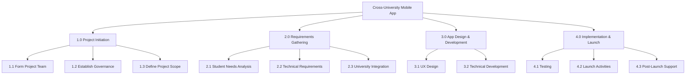
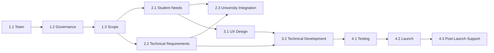

# Work Breakdown Structure & Schedule

The project is organised into four major phases: **Project Initiation**, **Requirements Gathering**, **App Design & Development**, and **Implementation & Launch**.

The supplied Gantt workbook contains **30 scheduled tasks** between 1 September 2025 and 23 February 2026. A machine-readable extract is available in [`data/gantt_schedule.csv`](../data/gantt_schedule.csv).

## WBS overview

## Detailed task groups

### 1. Project Initiation

- 1.0 Project Initiation
- 1.1 Form Project Team
  - 1.1.1 Recruit SU Representatives
  - 1.1.2 Engage University Partners
- 1.2 Establish Governance
  - 1.2.1 Establish Project Board
- 1.3 Define Project Scope
  - 1.3.1 Define Project Boundaries

### 2. Requirements Gathering

- 2.0 Requirements Gathering
- 2.1 Student Needs Analysis
  - 2.1.1 Focus Groups
  - 2.1.2 Online Surveys
- 2.2 Technical Requirements
  - 2.2.1 API Specifications
- 2.3 University Integration
  - 2.3.1 Data Sharing Protocols

### 3. App Design & Development

- 3.0 App Design & Development
- 3.1 UX Design
  - 3.1.1 Wireframing
  - 3.1.2 Prototyping
- 3.2 Technical Development
  - 3.2.1 Frontend Development
  - 3.2.2 Backend Development

### 4. Implementation & Launch

- 4.0 Implementation & Launch
- 4.1 Testing
  - 4.1.1 User Acceptance Testing
- 4.2 Launch Activities
  - 4.2.1 Marketing Campaign
- 4.3 Post-Launch Support
  - 4.3.1 Feedback Collection

## Milestones

The source report identifies four major milestones:

| ID | Milestone | Timing in report |
|---|---|---|
| M1 | Project Team Formed | Week 2 |
| M2 | Requirements Document Approved | Week 7 |
| M3 | Design Prototype Approved | Week 10 |
| M4 | App Launch | Week 20 |

## Dependencies recorded in the Gantt workbook

1. `1.1` must be completed before `1.2` can start.
2. `1.3` depends on completion of `1.2`.
3. `2.1` and `2.2` can run in parallel after `1.3`.
4. `2.3` depends on completion of `2.1` and `2.2`.
5. `3.1` depends on completion of `2.1`.
6. `3.2` depends on completion of `2.2` and `3.1`.
7. `4.1` depends on completion of `3.2`.
8. `4.2` depends on successful completion of `4.1`.
9. `4.3` begins after `4.2` is completed.

## Schedule boundary note

The original PID states a project end date of **31 August 2026**, while the detailed workbook ends on **23 February 2026**. This repository does not invent additional tasks for the missing period. The detailed schedule is reproduced only to the extent supported by the supplied workbook.
